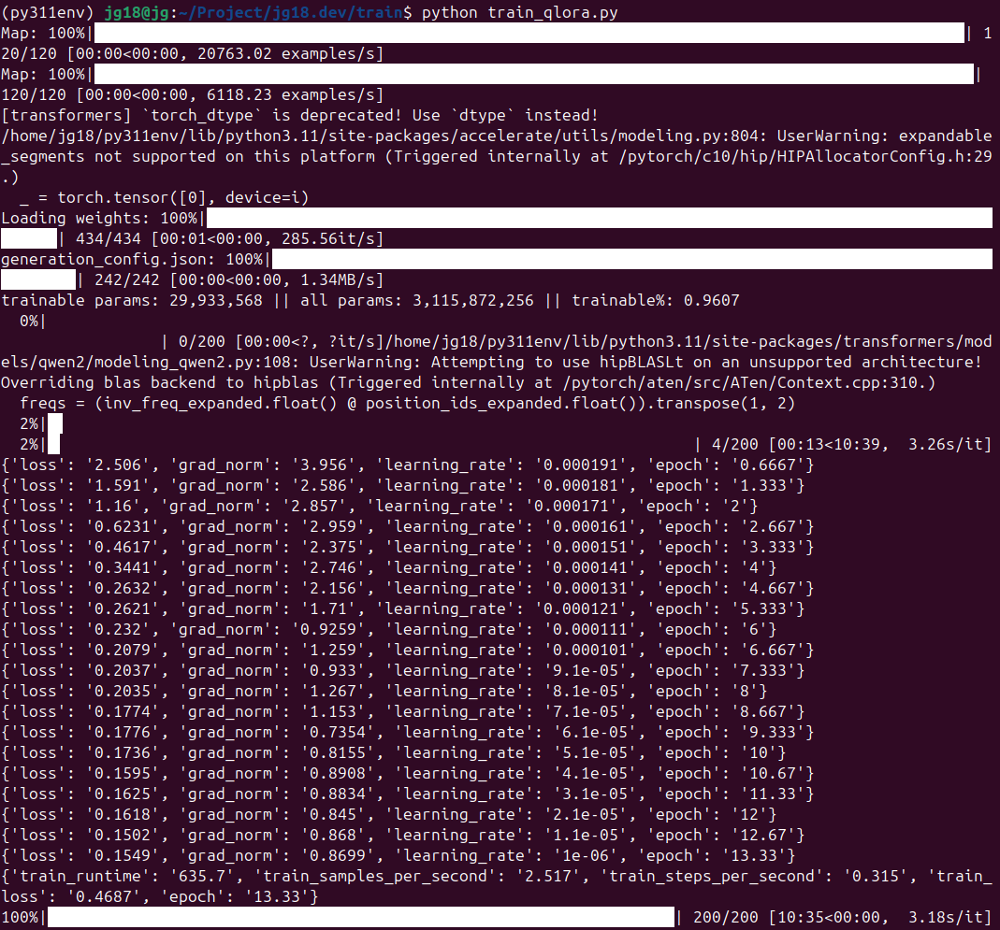
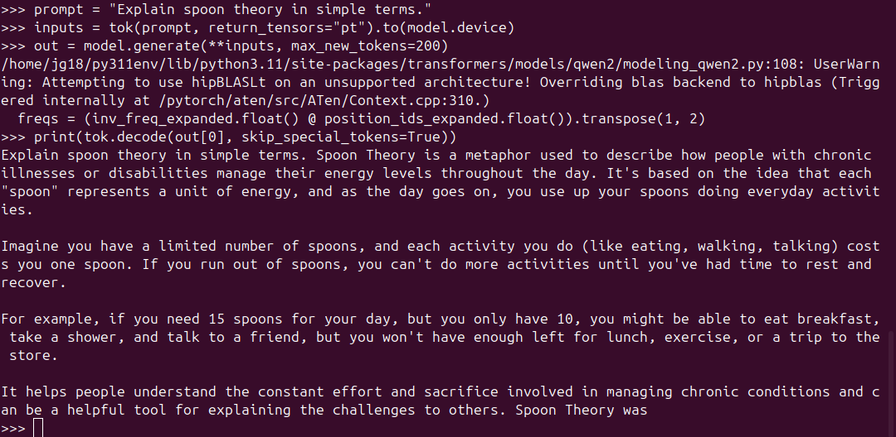
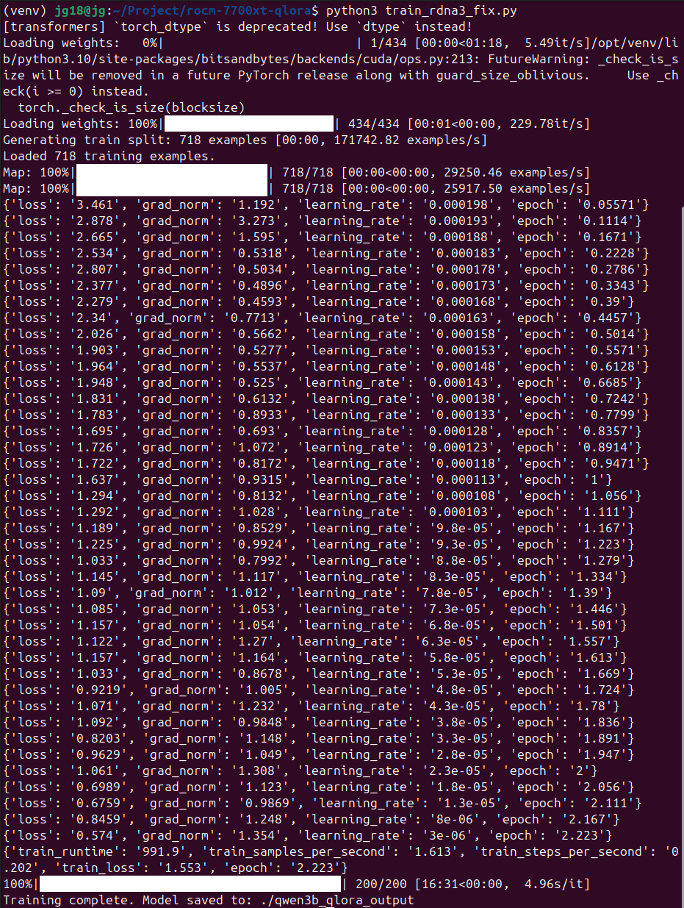

# Qwen2.5‑3B QLoRA Training (AMD ROCm + 4‑bit NF4)

A fully RDNA3‑safe QLoRA training pipeline for fine‑tuning  
**Qwen/Qwen2.5‑3B‑Instruct** using **4‑bit NF4 quantization** and **LoRA adapters**,  
optimized for AMD GPUs running ROCm 6.x.

This repository is designed for **local‑first**, **reproducible**, **12GB‑VRAM‑friendly** training on GPUs such as the **Radeon RX 7700 XT**.

---

## Features
- RDNA3‑safe training (BitsAndBytes NF4 + fp16 compute)
- ROCm‑safe optimizer (`paged_adamw_32bit`)
- LoRA rank 64 tuned for Qwen2.5
- Works on 12GB VRAM
- Clean JSONL dataset format
- CPU‑safe LoRA merge into a single fp16 safetensors model
- RDNA3 stability settings included in all scripts

---

## Requirements
- AMD GPU with RDNA3 architecture (gfx1100/1101/1102)
- ROCm 6.1 or 6.2
- Python 3.10
- 12GB VRAM minimum
- 16GB RAM recommended

---

## System Requirements

This pipeline is tested and verified on AMD RDNA3 hardware using ROCm 6.x.  
ROCm is sensitive to kernel and OS versions, so matching these is important.

### Supported Operating Systems
- Ubuntu **24.04 LTS (Noble)** — recommended
- Ubuntu **22.04 LTS (Jammy)** — supported with ROCm 6.x

### Required Kernel Versions
ROCm 6.x requires a kernel in the **6.8.x** series for stable RDNA3 support.

Verified working kernels:
- `6.8.0-49-generic`
- `6.8.0-50-generic`

Not recommended:
- 7.x kernels (ROCm DKMS modules fail to build)
- 5.x kernels (missing RDNA3 support)

### Required ROCm Version
- ROCm **6.1** or **6.2** recommended  
- ROCm 6.0 works but is unstable on RDNA3  
- ROCm 5.x does *not* support RDNA3 GPUs

### GPU Support
- RDNA3 (gfx1100, gfx1101, gfx1102)
- Tested specifically on **Radeon RX 7700 XT (gfx1101)**

---

## Verified Build Information

| Component        | Value                                   |
|------------------|-------------------------------------------|
| GPU              | AMD Radeon RX 7700 XT (gfx1101)          |
| ROCm Version     | 6.1                                       |
| OS               | Ubuntu 24.04.4 LTS (Noble)                |
| Kernel Version   | 6.8.0-49-generic                          |
| Python Version   | 3.10.x                                    |
| PyTorch Build    | ROCm-enabled PyTorch (from rocm repo)     |
| VRAM             | 12 GB                                     |
| RAM              | 32 GB                                     |
| Storage          | NVMe SSD                                  |
| Virtual Env      | venv (Python 3.10)                        |

---

## Install Dependencies

```bash
pip install transformers accelerate datasets peft bitsandbytes
```

---

## Dataset Format

Store training data in `data/train.jsonl`, one JSON object per line:

```json
{"instruction": "Explain spoon theory.", "input": "", "output": "Spoon theory is..."}
{"instruction": "Rewrite accessibly.", "input": "Original text", "output": "Accessible rewrite"}
```

The training script converts each example into:

```
### Instruction
{instruction}
### Input
{input}
### Output
{output}
```

---

## Training

Run the RDNA3‑safe training script:

```bash
python train_rdna3_fix.py
```

On success, you should see:
- trainable params ≈ 29.9M  
- loss decreasing  
- steps progressing 0 → 200  

The LoRA adapter is saved to:

```
qwen3b_qlora_output/
```

---

## Merge LoRA into a Single fp16 Model

After training, merge the adapter into a standalone fp16 model:

```bash
python merge_qwen_lora_final.py
```

This produces:

```
qwen3b_merged_fp16_final/
    model.safetensors
    config.json
    tokenizer.json
```

This merged model **does not require PEFT** and is ready for inference.

---

## Inference (Merged Model)

```python
from transformers import AutoTokenizer, AutoModelForCausalLM
import torch

MODEL = "qwen3b_merged_fp16_final"

tok = AutoTokenizer.from_pretrained(MODEL, trust_remote_code=True)
tok.pad_token = tok.eos_token

model = AutoModelForCausalLM.from_pretrained(
    MODEL,
    torch_dtype=torch.float16,
    device_map={"": "cpu"},  # or "cuda:0" for GPU inference
    trust_remote_code=True,
)

prompt = "Explain spoon theory in simple terms."
inputs = tok(prompt, return_tensors="pt")
outputs = model.generate(**inputs, max_new_tokens=200)
print(tok.decode(outputs[0], skip_special_tokens=True))
```

---

## Screenshots (with DeafBlind-Standard Alt Text)

### Training Run


**Alt Text (DeafBlind Standard):**  
A terminal window showing a QLoRA training session for Qwen2.5‑3B.  
The screen displays progress bars, step counts, and loss values decreasing over time.  
Key metrics include:  
- trainable parameters around 29.9 million  
- total parameters around 3.1 billion  
- loss values trending downward (e.g., 2.50 → 1.59 → 0.62 → 0.17)  
- training steps progressing from 0/200 to 200/200  
ROCm warnings appear but do not interrupt training.

### Model Output (Inference Test)


**Alt Text (DeafBlind Standard):**  
A Python REPL window showing the merged model responding to  
“Explain spoon theory in simple terms.”  
The model provides a clear, accessible explanation describing spoons as  
units of energy used by people with chronic illness to manage daily tasks.

## RDNA3 Training Stability — Before vs After Fixes

### Before RDNA3 Fixes (Early Attempt)

**Alt Text (DeafBlind Standard):**  
A terminal window showing an early QLoRA training attempt on an AMD RDNA3 GPU *before* applying the RDNA3 stability fixes.  
The run shows irregular loss behavior, intermittent ROCm warnings, and inconsistent step timing.  
Training does not complete a full stable cycle, and the output suggests allocator pressure and warmup instability typical of RDNA3 without environment overrides.

---

### After RDNA3 Fixes Applied (Stable Training)

**Alt Text (DeafBlind Standard):**  
A terminal window showing a complete QLoRA training session for Qwen2.5‑3B after RDNA3 stability fixes were applied.  
The screen displays step‑by‑step logs with steadily decreasing loss values, normal gradient norms, and consistent learning rates.  
All 718 training examples are processed, and the run completes all scheduled steps without ROCm warmup crashes or allocator failures.  
The final summary shows runtime, samples per second, steps per second, and a final training loss around 1.55.  
The last line confirms: “Training complete. Model saved to: /qwen3b_qlora_output”.  
This screenshot demonstrates that the RDNA3 environment overrides successfully stabilized the training environment.

---

### RDNA3 Stability Credits
This project incorporates RDNA3‑specific ROCm fixes originally documented by
**Beat‑k** in the **BEATEK_ROCm** project (https://github.com/Beat-k/BEATEK_ROCm).
Their research into HSA overrides, SDMA enablement, allocator behavior, and
PyTorch initialization quirks directly informed the `.bashrc` environment
settings used to stabilize QLoRA training on RDNA3 GPUs.

---

## License
MIT for repository code.  
Model weights follow their respective license terms.

